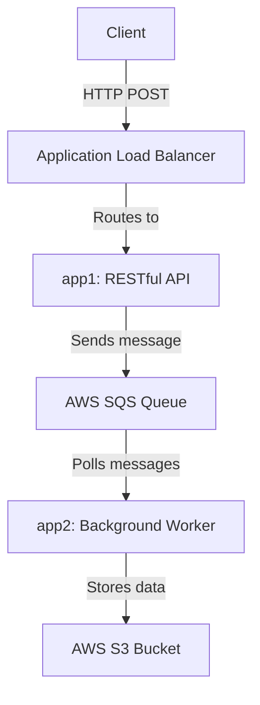

# System Architecture Diagram

```mermaid
graph TD
    Client -->|HTTP POST| ALB[Application Load Balancer]
    ALB -->|Routes to| app1[app1: RESTful API]
    app1 -->|Sends message| SQS[AWS SQS Queue]
    SQS -->|Polls messages| app2[app2: Background Worker]
    app2 -->|Stores data| S3[AWS S3 Bucket]
```
